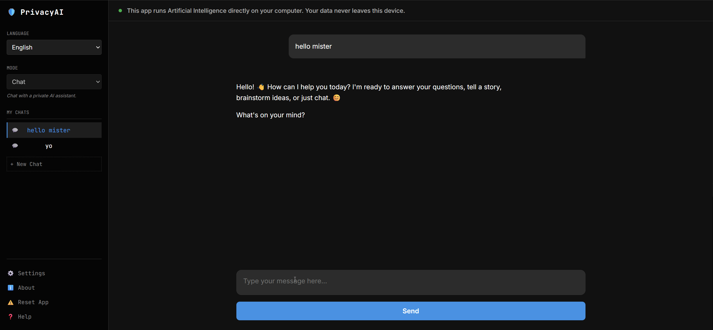

# PrivacyAI 🛡️

**PrivacyAI** is a private, local-first AI assistant that runs entirely in your browser. It uses Google Chrome's built-in Gemini Nano model to provide Chat, Writing, and Editing capabilities without sending a single byte of your data to the cloud.

<div align="center">
  
</div>

## 🚀 Key Features

*   **100% Private**: Your chats, drafts, and data are stored locally in your browser's IndexedDB. Nothing leaves your device.
*   **Offline Capable**: Once the model is downloaded, the app works without an internet connection.
*   **Multi-Mode AI**:
    *   **Chat**: General purpose assistant with auto-naming and instant access.
    *   **Writer**: Generate emails, articles, and stories.
    *   **Editor**: Fix grammar, rephrase text, and improve style.
*   **Customizable**: Set global System Prompts (e.g., "You are a pirate") via Settings.
*   **Localized**: Fully translated into English, Lithuanian, Polish, German, Spanish, and Japanese.
*   **PWA Support**: Installable as a native-like app on your desktop.

## 🛠️ Requirements

PrivacyAI relies on experimental AI APIs available in **Chrome Canary** (or Dev).

*   **Browser**: [Chrome Canary](https://www.google.com/chrome/canary/) (Version 128+)
*   **Hardware**: A device capable of running Gemini Nano (most modern laptops/desktops).

## ⚙️ Setup Guide

To enable the local AI, you must configure a few browser flags:

1.  Open `chrome://flags` in a new tab.
2.  Search for and **Enable** the following:
    *   `Enables optimization guide on device`: set to **Enabled BypassPerfRequirement**
    *   `Prompt API for Gemini Nano`: **Enabled**
    *   `Writer API for Gemini Nano`: **Enabled**
    *   `Rewriter API for Gemini Nano`: **Enabled**
3.  **Restart Chrome**.
4.  Open `chrome://components`.
5.  Find **Optimization Guide On Device Model** and click **Check for Update**.
    *   *Note: If the version is `0.0.0.0`, it is still downloading the model (approx 1-2GB). Wait for it to show a valid version number.*

## 🏃 Running Locally

To run the project on your machine:

1.  Clone the repository:
    ```bash
    git clone https://github.com/yourusername/PrivacyAI.git
    cd PrivacyAI
    ```
2.  Start a simple HTTP server (Python example):
    ```bash
    python -m http.server 8000
    ```
3.  Open `http://localhost:8000` in Chrome Canary.

## 🏗️ Project Structure

This project is built as a Vanilla JS Single Page Application (SPA), utilizing modern ES6 modules.

```
/
├── index.html          # Main entry point (App Shell)
├── manifest.json       # PWA manifest containing metadata and icons
├── server.py           # Simple Python script to serve the app locally (HTTPS/Localhost required)
├── css/
│   └── style.css       # Core styling (Variables, Dark Theme, Layouts)
└── js/
    ├── app.js          # Core Application Controller (Start logic, Event Delegation)
    ├── ui.js           # UI Manager (DOM Manipulation, View Switching, Modals)
    ├── ai.js           # AI Strategy Pattern (Interface to Chrome Prompt/Writer APIs)
    ├── storage.js      # IndexedDB Wrapper (Project & Chat History Persistence)
    └── locales.js      # Localization Dictionary (EN, LT, PL, DE, ES, JA)
```

## 📐 Architecture Overview

The application follows a **Modular MVC-like** pattern:

1.  **AI Switchboard (`ai.js`)**:
    *   Acts as the central adapter for all AI operations.
    *   Abstracts `window.ai` (Chrome Built-in AI) and `window.ai.languageModel` APIs.
    *   Implements a **Strategy Pattern** to switch between `ChatStrategy`, `WriterStrategy`, and `RewriterStrategy` dynamically.
    *   Provides fallback logic ("Simulated Mode") where specific APIs (like Writer) are emulated using the generic Prompt API with system instructions.

2.  **State Management (`storage.js`)**:
    *   Uses **IndexedDB** to store persistent data.
    *   Manages `Projects` (Chat Sessions) and `GlobalSettings`.
    *   No external database required.

3.  **UI Controller (`ui.js`)**:
    *   Handles all DOM updates and View states (`Chat`, `Writer`, `Editor`).
    *   Manages Modals (Settings, Renaming, Help).
    *   Implements client-side localization logic (`setLanguage`).
    *   **Data Binding**: Updates UI elements based on state changes triggered by `app.js`.

4.  **Application Logic (`app.js`)**:
    *   The "Brain" that glues everything together.
    *   Initializes the app, checks generic AI availability/diagnostics.
    *   Handling routing (Switching views).
    *   Manages the Generative Loop (Streaming responses from AI).
    *   Sets up global Event Listeners.

## 🤝 Contributing

We welcome contributions! Please follow these steps:

1.  Fork the repository.
2.  Create a feature branch (`git checkout -b feature/NewFeature`).
3.  Commit your changes.
4.  Push to the branch.
5.  Open a Pull Request.

## 📄 License

This project is open-source and available under the [MIT License](LICENSE).

---

**Note**: This is an experimental project using Early Preview APIs. Functionality may change as Chrome evolves.
